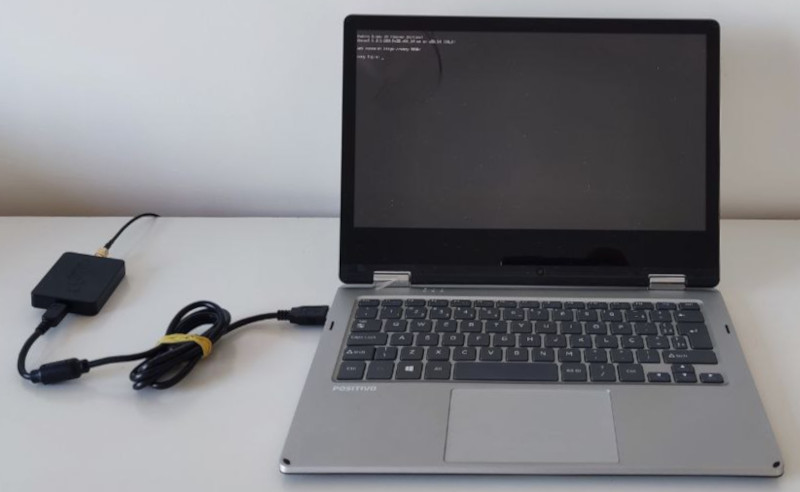
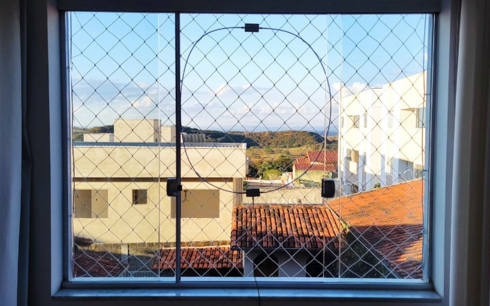
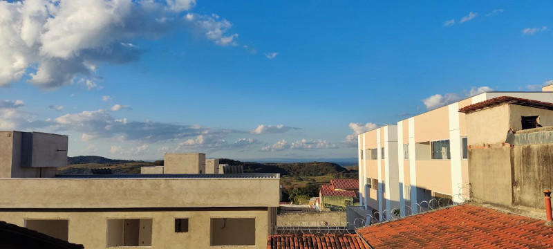

Estação mobiliada com equipamento AirSpy HF+ utilizando o software SDR# para 
difusão dos sinais de rádio através da Internet, sediada no município de Pedro 
Leopoldo/MG bairro Parque Andiara, mantida por André Carvalhais.

## Link de acesso
A ser disponibilizado.

## Informações técnicas
| Parâmetro        | Detalhamento                                    |
|------------------|-------------------------------------------------|
| _Receptor_       | AirSpy HF+                                      |
| _Faixa de freq._ | 0.5 KHz a 260 MHz                               |
| _Span máximo_    | 660 Khz                                         |
| _BW do canal_    | 15 KHz                                          |
| _Antena_         | Loop magnética                                  |
| _Daemon_         | SpyServer versão 2.0.1700                       |
| _Sist. Oper._    | Fedora Linux 38 (Server Edition)                |
| _Hardware_       | Mini PC com Intel Atom @ 1.44 Ghz e 4 GB de RAM |
| _Coordenadas_    | -44.031887, -19.602574                          |

## Observações
Antena instalada em janela de apartamento com visão desobstruída da direção 
geral NE. Boa relação sinal ruído, com poucos sinais interferentes que tendem a 
diminuir durante a noite. Ótima recepção de estações de radiodifusão de ondas 
curtas da Europa e Ásia. Ótima recepção de sinais de comunicação aeronáutica do 
aeroporto de Confins (código IATA CNF).

**Atenção**: o rádio definido por software não é acessível diretamente pelo 
navegador, o acesso é feito de forma nativa através do software 
[SDR#](https://airspy.com/download/), que deve ser previamente instalado no 
computador do usuário.

## Fotografias
_Fotografia da estação_:

_Fotografia da antena_:

_Fotografia da vista_:
